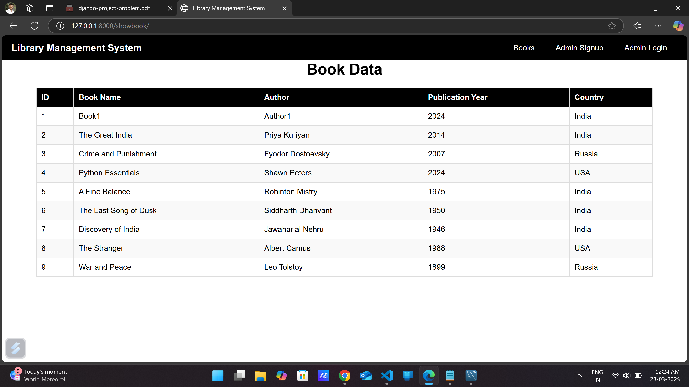
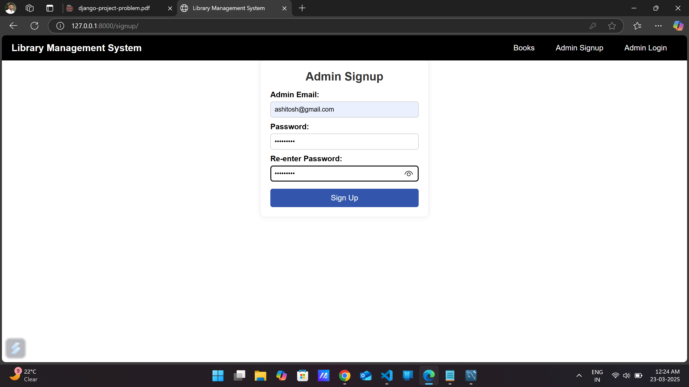
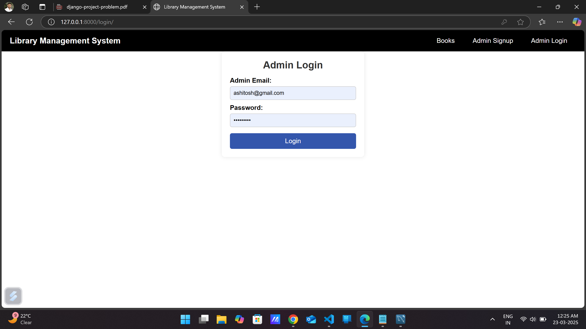
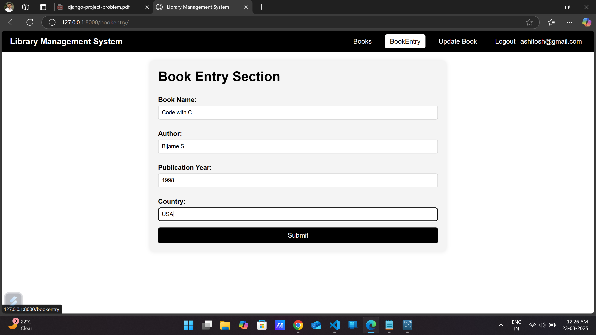
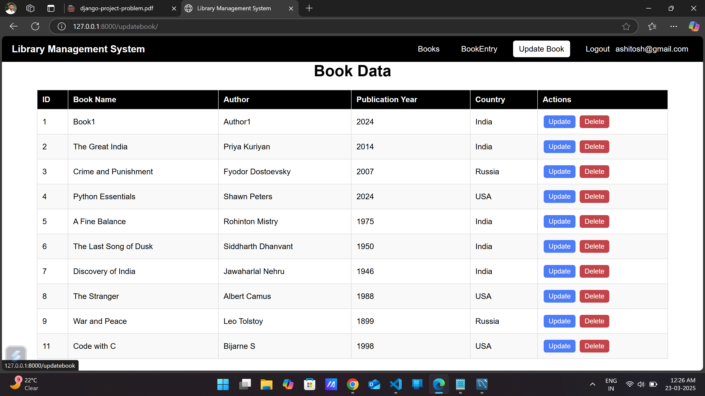
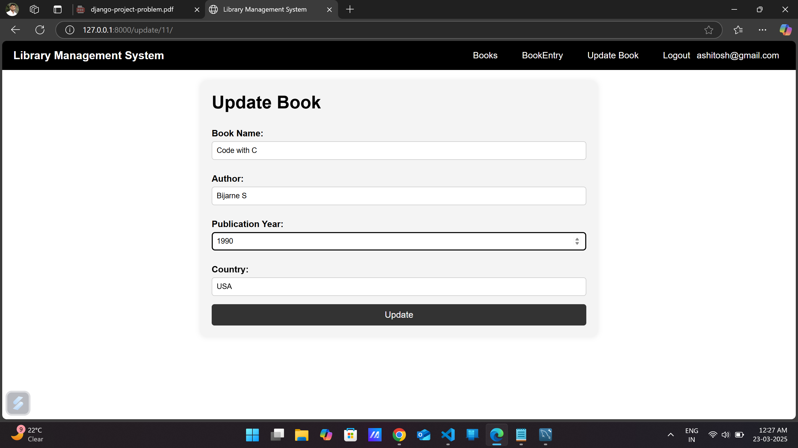
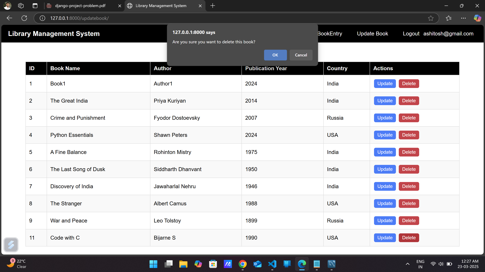
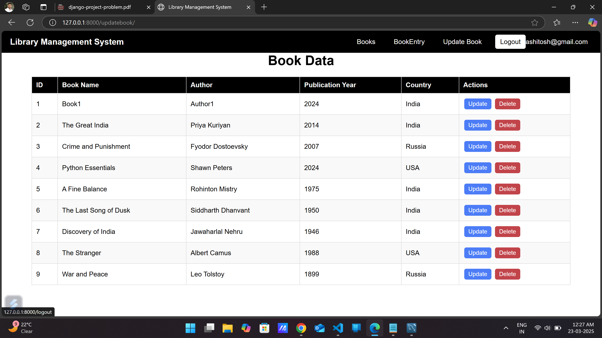
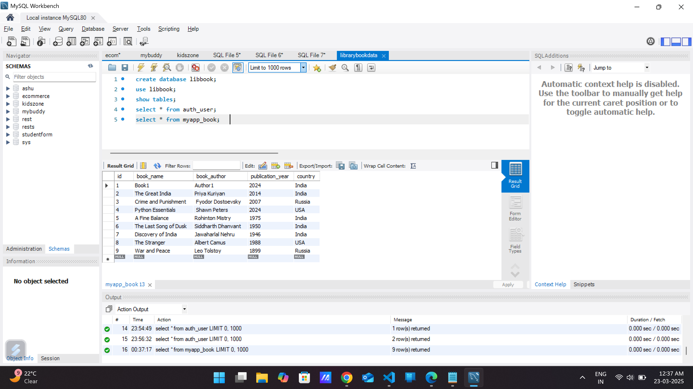

# Library Management System 

## Introduction
The **Library Management System** is a web-based application built using **Django** and **Django Rest Framework (DRF)**. It allows administrators to manage books efficiently, including adding, updating, and deleting book records. The system also includes **user authentication, CSRF protection, and validation mechanisms** to ensure secure and reliable data management.

## Technologies Used 
- **Backend:** Django, Django Rest Framework (DRF), Python
- **Frontend:** HTML, CSS, JavaScript
- **Database:** MySQL
- **Authentication:** Django's built-in User Model
- **Security Features:** CSRF Protection, Form Validation

## Features 
- **User Authentication:** Signup, Login, Logout
- **Book Management:** Add, Update, Delete, View Books
- **Validation Mechanisms:**
  - Required fields validation
  - Password match validation
  - Unique email validation for admin signup
- **Security:**
  - CSRF tokens for secure data transmission
  - Django's built-in authentication
- **REST API Implementation (DRF)**

## Installation and Setup 
1. **Clone the Repository**
   ```bash
   git clone https://github.com/ashurohom/-library-management-system.git
   cd library-management-system
   ```

2. **Create and Activate Virtual Environment**
   ```bash
   python -m venv venv
   source venv\Scripts\activate
   ```

3. **Install Dependencies**
   ```bash
   pip install -r requirements.txt
   ```

4. **Apply Migrations**
   ```bash
   python manage.py makemigrations
   python manage.py migrate
   ```

5. **Admin Access (Register New Admin)or(Create a Superuser) **
   ```bash
   python manage.py createsuperuser
   ```

6. **Run the Development Server**
   ```bash
   python manage.py runserver
   ```
   Access the project at Default Link **http://127.0.0.1:8000/**


## Project Explanation 
This system is designed to **simplify library book management** by enabling admins to efficiently manage books through a web-based interface. The project uses **Django's authentication system** to ensure only authorized users can make changes. All forms include **CSRF tokens** for protection against cross-site request forgery attacks. Additionally, **Django Rest Framework (DRF)** allows for **API-based interactions** for potential integration with other systems.

### 1 Home Page

* Home Page (Screenshot Explanation)
Home Page Overview:

-The home page displays the navigation bar and book data.

-Before the admin logs in, students can only view the book details.

-After the admin logs in, they can perform CRUD operations on the book details.

-The home page is accessible at the default link: 127.0.0.1:8000/.


### 2 Admin Signup Page

* Signup Page (Screenshot Explanation)

-The admin signup page allows new administrators to create an account.

-It requires the admin to enter an email, password, and re-enter the password for confirmation.

-If any field is empty, an error message is displayed.

-If the passwords do not match, an error message is shown.

-If the email is already registered, a message alerts the user.

-After successful signup, the admin is redirected to the login page.

-CSRF tokens are used for security to prevent cross-site request forgery.


### 3 Admin Login Page

* Login Page (Screenshot Explanation)

-The admin login page allows registered administrators to access the system.

-The admin needs to enter a registered email and password to log in.

-If any field is left empty, an error message is displayed.

-If incorrect credentials are provided, an error message alerts the user.

-Upon successful login, the admin is redirected to the home page.

-Only logged-in admins can perform CRUD operations on books.

-CSRF tokens are used for secure authentication.


### 4 Book Enter Page

* Book Entry Page (Screenshot Explanation)

-The book entry page allows the admin to add new books to the library database.

-The admin must provide the book name, author name, publication year, and country.

-All fields are required; if any field is left empty, an error message is displayed.

-After submitting the form, the book details are stored in the database.

-Upon successful entry, the admin is redirected to the book update page.

-Only logged-in admins can access this page.

-CSRF tokens are used for secure form submission.


### 5 Book Action Page

* Book Action Page (Screenshot Explanation)

-The book action page displays a list of all books stored in the database.

-Each book entry includes details such as book name, author, publication year, and country.

-Admin users can update or delete any book directly from this page.

-Clicking the Update button redirects the admin to the Book Update Page, where modifications can be made.

-Clicking the Delete button removes the book entry from the database after confirmation.

-This page is only accessible to logged-in admins.

-CSRF tokens are used to ensure secure actions.


### 6 Update Book Data Page

*Update Book Data Page (Screenshot Explanation)

-The book update page allows the admin to modify existing book details in the library database.

-The admin can edit the book name, author name, publication year, and country.

-When the admin submits the updated details, the changes are saved in the database.

-If any field is left empty, an error message is displayed.

-Only logged-in admins can access this page and make modifications.

-Upon successful update, the admin is redirected to the Show Books page.

-CSRF tokens are used to ensure secure form submission.


### 7 Delete Book Data Page

*Delete Book Data Page (Screenshot Explanation)


-The Delete functionality allows the admin to remove a book from the system permanently.

-On the Book Action Page, each book entry has a Delete button.

-When the admin clicks the Delete button, the book is immediately removed from the database.

-This action ensures that outdated or incorrect book records can be managed efficiently.

-Only logged-in admins have the authority to delete books.

-CSRF tokens are implemented to prevent unauthorized deletions.


### 8 Logout Admin 

*Logout Admin (Screenshot Explanation)

-The Logout button allows the admin to securely log out from the system.

-Once logged out, the admin cannot perform any CRUD operations on books.

-After clicking Logout, the user is redirected to the Home Page, where they can only view book details.

-Implemented Django's built-in authentication logout method to ensure secure session termination.

-CSRF protection is used to prevent unauthorized logout requests.


### 9 SQl Workbench 

*SQL Workbench (Screenshot Explanation)


-SQL Workbench was used to manage the database for the Library Management System.

-A book table was created to store book records, including book name, author, publication year, and country.

-The default auth_user table was used for admin authentication, eliminating the need to create a separate admin table.

-The book table contains all CRUD operations (Create, Read, Update, Delete) for managing book records.

-SQL Workbench provides an interface to view, insert, update, and delete records directly from the database.

-The database structure ensures efficient storage and retrieval of book information.

-The Django ORM (Object-Relational Mapping) was used to interact with the database, simplifying database operations.

-Screenshots of SQL Workbench show the book table structure and stored data.
